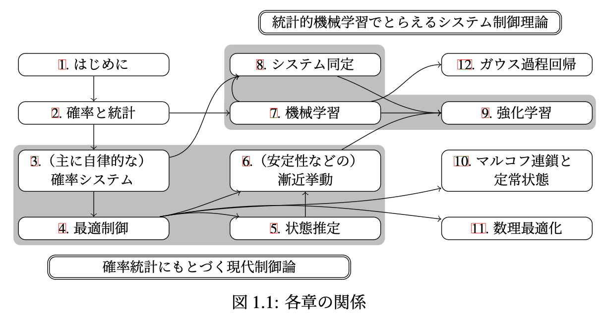

## 書籍情報

- 著者　加嶋 健司  
- 出版社　森北出版  
- 出版年　2025年
- ISBN　978-4-627-61481-9
- 引用情報  
加嶋 健司，システム制御理論と統計的機械学習，森北出版，2025  
Kenji Kashima, *Systems Control Theory and Statistical Machine Learning*, Morikita Publishing Co., Ltd., 2025
- 目次　[一覧](./TOC.md)，[まえがき](https://note.com/morikita/n/necd5dff91e69)

   

  

---

## 追加資料

最新版および更新履歴はgithubレポジトリ   [ctrl-kuinfo/ctml-book](https://github.com/ctrl-kuinfo/ctml-book/) をご参照ください。

### 正誤表および補足情報

- [一覧](./errata.md)

### 数値計算コード

書籍内の数値計算に用いた簡易コードです。可視化による理解の促進を目的として定理などをベタ打ちしたもので、高速化などは考慮しておりません。

- Matlab [.mファイル一式(zip)](https://github.com/ctrl-kuinfo/ctml-book/raw/refs/heads/main/matlab.zip) ※ MATLAB Onlineでも実行可能（Figure 11_1 のみ要sedumiなど）

- Python [.pyファイル一式(zip)](https://github.com/ctrl-kuinfo/ctml-book/raw/refs/heads/main/python.zip) ※ 単独で実行可能（config.pyのみ描画設定ファイル）

### スライド

独学用ロードマップやセミナー資料を想定して、各章の概要を整理したスライドです。講義などのためにLaTeX(beamer)のソースファイルをご希望の方は、フィードバック用のフォームより、お名前、ご所属、用途をご連絡ください。

- [一覧](https://github.com/ctrl-kuinfo/ctml-book/tree/main/slides)

---

### フィードバック

- [フォーム](https://forms.gle/7HsvDCpM9HxijZ9a8)
